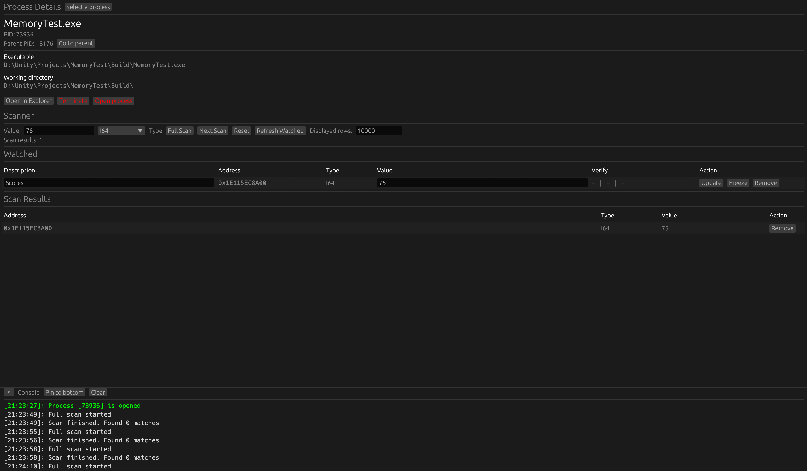

# Memory Analyzer (Rust + eframe/egui)

A small desktop memory scanner for Windows written in Rust: process picker, full/next scan, watched addresses, value updates, freeze mode, and write verification in one UI.

This project is a practical playground for low-level WinAPI memory access + immediate mode UI with a minimal, hackable codebase.

Created without vibecoding

* * *

## Screenshot



> Main window: process details, scanner, watched table, and scan results.

* * *

## Features

- Process selection UI with grouped process list and search (`name / pid / exe`)
- Safe process switch flow with reset warning modal when an opened process exists
- Process tools:
  - open selected executable in Explorer
  - terminate process from UI
  - open process for read/write scan session
- Scanner:
  - `Full Scan` (async worker + progress updates)
  - `Next Scan` filtering for numeric types
  - supported scan types: `I32`, `I64`, `F32`, `F64`, `UTF8String`, `UTF16String`
  - configurable displayed rows limit (`scan_results_count`)
- Watched table:
  - editable `description` + editable `value`
  - `Update`, `Freeze/Unfreeze`, `Remove`
  - one-line write verification status (`OK | OK | OK`)
    - write result
    - immediate reread
    - reread after 100ms
- Console panel with pin-to-bottom mode and clear action

* * *

## Tech Stack

- `Rust` (edition 2024)
- `eframe` / `egui` / `egui_extras` for UI
- `windows-sys` for WinAPI (`OpenProcess`, `ReadProcessMemory`, `WriteProcessMemory`, `VirtualQueryEx`, etc.)
- `sysinfo` for process list/system information
- `chrono` for timestamped logs

* * *

## Build & Run

### Requirements

- Windows 10/11
- Rust (stable)
- Cargo

### Run (debug)

```bash
cargo run
```

### Build (release)

```bash
cargo build --release
```

* * *

## Typical Usage

1. Click `Select a process` and choose target process.
2. Click `Open process`.
3. Enter value + type, then run `Full Scan`.
4. Change value in target app and use `Next Scan` (numeric types).
5. Add rows to `Watched`, edit value, press `Update` or enable `Freeze`.
6. Watch verification status to detect whether target app rewrites value back.

* * *

## Notes

- This tool is Windows-only.
- For managed runtimes (Unity/Mono/IL2CPP), some values/strings can move in memory after GC, so address stability is not guaranteed.
- String scans (`UTF8/UTF16`) are value-based snapshots; expect many duplicates in memory.

* * *

## License

MIT (see [LICENSE](LICENSE))
